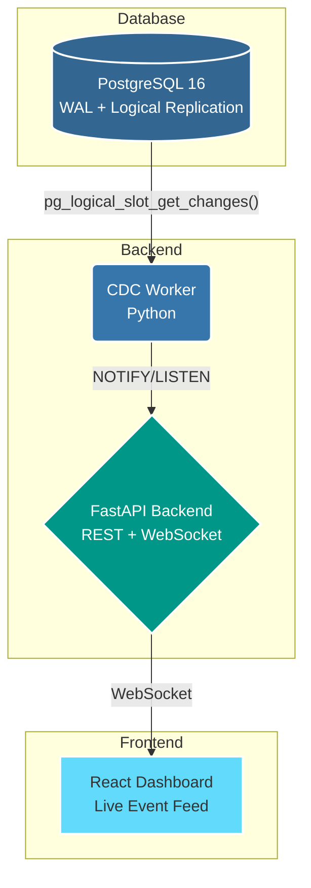

# ⚡ SimpleCDC

**Real-time Change Data Capture for PostgreSQL**

[](https://opensource.org/licenses/MIT)
[](http://makeapullrequest.com)
[](CODE_OF_CONDUCT.md)

SimpleCDC is a lightweight CDC platform that monitors PostgreSQL database changes in real time and streams them to a web dashboard. Built for developers who need visibility into database mutations without the complexity of Kafka, Debezium, or heavy infrastructure.


---

## Architecture



**Flow:** PostgreSQL WAL → CDC Worker polls via `wal2json` → Stores in `cdc_events` → Sends `NOTIFY` → Backend listens → Broadcasts via WebSocket → Dashboard updates live.

---

## Quick Start

### Prerequisites

- [Docker](https://docs.docker.com/get-docker/) & Docker Compose v2+

### Run (one command)

```bash
docker compose up --build
```

### Access

| Service    | URL                          |
| ---------- | ---------------------------- |
| Dashboard  | http://localhost:5173        |
| API        | http://localhost:8000/api    |
| Health     | http://localhost:8000/api/health |
| PostgreSQL | localhost:5432               |

### Generate Test Events

In a new terminal:

```bash
# Install psycopg if not installed
pip install 'psycopg[binary]'

# Generate 20 events at 1/sec
python scripts/generate_events.py

# Generate 50 events rapidly
python scripts/generate_events.py --count 50 --rate 0.2

# Burst 100 events instantly
python scripts/generate_events.py --count 100 --burst 1
```

Or connect directly to PostgreSQL and make changes:

```bash
docker compose exec postgres psql -U admin -d app -c \
  "INSERT INTO users (name, email) VALUES ('Test User', 'test@example.com');"
```

---

## API Reference

All endpoints require `X-API-Token: changeme` header (except `/api/health`).

### `GET /api/health`

Health check. No auth required.

### `GET /api/events`

Paginated CDC events.

| Param        | Type   | Default | Description            |
| ------------ | ------ | ------- | ---------------------- |
| `table_name` | string | —       | Filter by table        |
| `operation`  | string | —       | Filter: INSERT/UPDATE/DELETE |
| `limit`      | int    | 50      | Page size              |
| `offset`     | int    | 0       | Offset                 |

### `GET /api/events/{id}`

Single event by UUID.

### `GET /api/tables`

List tracked tables with event counts.

### `GET /api/stats`

Event statistics (total, rate, table count).

### `WebSocket /ws?token=changeme`

Real-time event stream. Messages:

```json
{"type": "cdc_event", "data": {"id": "...", "table_name": "users", "operation": "INSERT", "payload": {...}, "created_at": "..."}}
{"type": "connected", "message": "Connected to SimpleCDC"}
```

---

## Project Structure

```text
simplecdc/
├── docker-compose.yml          # Orchestration
├── .env                        # Environment config
├── postgres/
│   ├── Dockerfile              # PostgreSQL + wal2json
│   └── init.sql                # Schema, publication, seed data
├── cdc-worker/
│   ├── Dockerfile
│   ├── requirements.txt
│   ├── config.py               # Environment config
│   └── worker.py               # WAL listener + event capture
├── backend/
│   ├── Dockerfile
│   ├── requirements.txt
│   └── app/
│       ├── main.py             # FastAPI app + lifespan
│       ├── config.py           # Settings
│       ├── db.py               # Database connections
│       ├── models.py           # Pydantic schemas
│       ├── api/
│       │   ├── auth.py         # Token auth dependency
│       │   └── events.py       # REST endpoints
│       └── websocket/
│           └── handler.py      # WebSocket manager + NOTIFY listener
├── frontend/
│   ├── Dockerfile              # Multi-stage Node + Nginx
│   ├── nginx.conf              # Reverse proxy config
│   ├── package.json
│   └── src/
│       ├── components/         # React components
│       ├── hooks/              # Custom hooks
│       ├── services/           # API client
│       ├── pages/              # Dashboard page
│       └── types/              # TypeScript types
├── scripts/
│   └── generate_events.py      # Test event generator
└── README.md
```

---

## Configuration

All configuration is via environment variables in `.env`:

| Variable           | Default              | Description                     |
| ------------------ | -------------------- | ------------------------------- |
| `POSTGRES_USER`    | `admin`              | PostgreSQL superuser            |
| `POSTGRES_PASSWORD`| `admin`              | PostgreSQL password             |
| `POSTGRES_DB`      | `app`                | Database name                   |
| `API_TOKEN`        | `changeme`           | API authentication token        |
| `SLOT_NAME`        | `simplecdc_slot`     | Replication slot name           |
| `POLL_INTERVAL`    | `0.1`                | CDC polling interval (seconds)  |

---

## Tracked Tables

By default, SimpleCDC tracks `users` and `orders` tables. To add more tables to the publication:

```sql
ALTER PUBLICATION simplecdc_pub ADD TABLE your_table;
ALTER TABLE your_table REPLICA IDENTITY FULL;  -- Recommended for UPDATE/DELETE
```

---

## Troubleshooting

### Events not appearing?

1. Check CDC worker logs: `docker compose logs cdc-worker`
2. Verify replication slot exists: `docker compose exec postgres psql -U admin -d app -c "SELECT * FROM pg_replication_slots;"`
3. Verify publication: `docker compose exec postgres psql -U admin -d app -c "SELECT * FROM pg_publication_tables;"`

### WebSocket not connecting?

1. Check backend logs: `docker compose logs backend`
2. Verify backend is healthy: `curl http://localhost:8000/api/health`

### Clean restart

```bash
docker compose down -v   # Remove volumes too
docker compose up --build
```

---

## Contributing

Contributions are what make the open source community such an amazing place to learn, inspire, and create. Any contributions you make are **greatly appreciated**.

Please see our [CONTRIBUTING.md](CONTRIBUTING.md) for details on how to get started, and our [CODE_OF_CONDUCT.md](CODE_OF_CONDUCT.md) to understand the expectations we have for our community.

---

## License

Distributed under the MIT License. See `LICENSE` for more information.
